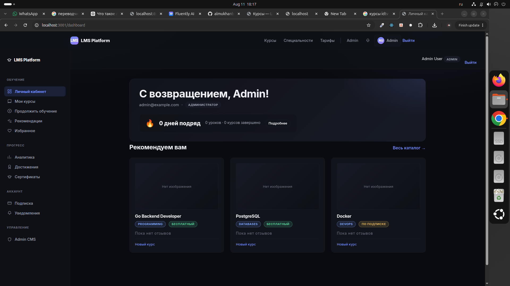

# COURSE LMS

COURSE — учебная LMS-платформа с backend на Go + Gin, PostgreSQL и frontend на Next.js.

## Стек

### Backend
- Go
- Gin
- PostgreSQL 17
- Goose migrations
- pgx / pgxpool

### Frontend
- Next.js
- TypeScript
- App Router

### Infrastructure
- Docker
- Docker Compose

## Основные возможности

- Регистрация и авторизация
- Роли пользователей
- Курсы и уроки
- Запись на курс
- Прогресс обучения
- Continue Learning
- Wishlist
- Персональные рекомендации курсов
- Similar Courses
- Roadmap / specialties
- Тесты и задания
- Coding exercises
- Сертификаты
- Achievements
- Streaks
- Analytics
- Notifications
- Instructor dashboard
- Admin dashboard
- Подписки и платежи

## Структура проекта

```text
COURSE/
├── backend/
├── frontend/
├── .claude/
│   └── skills/
├── docker-compose.yml
├── .env.example
├── STAGE18_PROGRESS.md
└── README.md

## Screenshots

### Dashboard

